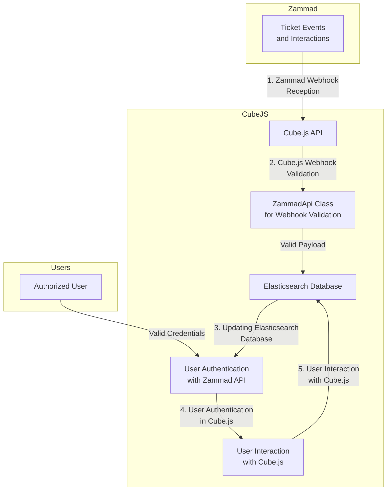

## Cube.js Integration with Zammad Webhooks

## Overview

In this integration, Cube.js acts as a middleware between Zammad, an open-source ticketing system, and an Elasticsearch database. The primary functionalities include receiving and validating Zammad webhooks, updating an Elasticsearch database based on the webhook data, and authenticating Cube.js users.

## Workflow

### 1\. Zammad Webhook Reception

When events occur in Zammad, such as ticket updates or new interactions, Zammad sends webhooks to Cube.js. These webhooks contain relevant data about the events.

### 2\. Cube.js Webhook Validation

Upon receiving a Zammad webhook, Cube.js utilizes the `ZammadApi` class to validate the webhook payload. The validation checks for the presence of required fields and ensures the integrity of the data received from Zammad.

### 3\. Updating Elasticsearch Database

If the Zammad webhook payload is valid, Cube.js processes the data and updates an Elasticsearch database. This database likely stores information related to Zammad tickets, user interactions, or other relevant data.

### 4\. User Authentication in Cube.js

When users interact with Cube.js, the application validates their credentials using the Zammad API. This involves setting and validating Zammad API tokens to authenticate Cube.js users.

### 5\. User Interaction with Cube.js

Once authenticated, users can interact with Cube.js functionalities, such as querying data or performing analytics. Cube.js ensures that only authorized users with valid Zammad credentials can access and manipulate the data.

