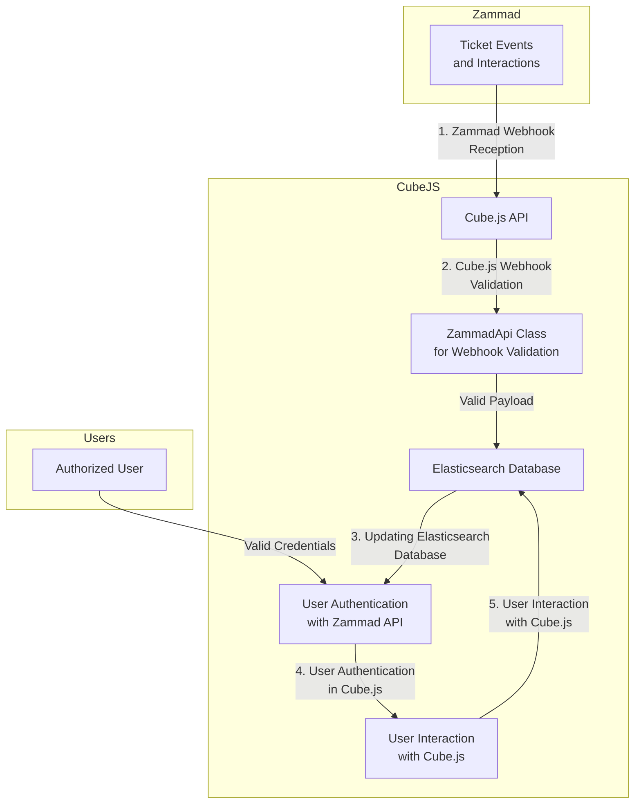

## Cube.js Integration with Zammad Webhooks

## Overview

In this integration, Cube.js serves as a middleware between Zammad, an open-source ticketing system, and an Elasticsearch database. The key functionalities encompass the reception and validation of Zammad webhooks, updating an Elasticsearch database based on the webhook data, and authenticating Cube.js users.

## Workflow

### 1. Zammad Webhook Reception

Whenever events that are being tacked occur in Zammad, such as User updates, Zammad dispatches webhooks to Cube.js. These webhooks encapsulate pertinent data regarding the events.

### 2. Cube.js Webhook Validation

Upon receipt of a Zammad webhook, Cube.js employs the `ZammadApi` class to validate the webhook payload. The validation process checks for the presence of required fields and ensures the integrity of the data received from Zammad.

### 3. Updating Elasticsearch Database

If the Zammad webhook payload proves valid, Cube.js processes the data and effectuates updates to an Elasticsearch database. This database likely houses information pertinent to Zammad tickets, user interactions, or other relevant data.

### 4. User Authentication in Cube.js

During user interaction with Cube.js, the application verifies their credentials using the Zammad API. This entails the establishment and validation of Zammad API tokens to authenticate Cube.js users.

### 5. User Interaction with Cube.js

Once authenticated, users can engage with Cube.js functionalities, such as querying data or performing analytics. Cube.js ensures that only authorized users possessing valid Zammad credentials can access and manipulate the data.

**Demo App:** [Cube.js Zammad Integration Demo](https://dashboard-cube-six.vercel.app/#/)
