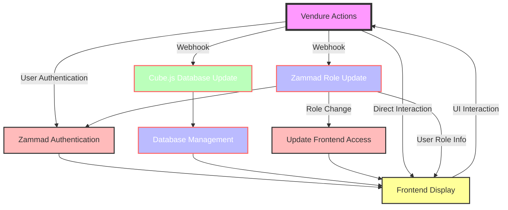

```mermaid
graph TD
    A[Vendure Actions] -->|Webhook| B[Zammad Role Update]
    A -->|Webhook| C[Cube.js Database Update]
    A -->|User Authentication| D[Zammad Authentication]
    B --> D
    D --> E[Frontend Display]
    C --> F[Database Management]
    F --> E
    B -->|Role Change| G[Update Frontend Access]
    G --> E
    A -->|Direct Interaction| E
    B -->|User Role Info| E
    E -->|UI Interaction| A
    style A fill:#f9f,stroke:#333,stroke-width:4px
    style B fill:#bbf,stroke:#f66,stroke-width:2px,color:#fff
    style C fill:#bfb,stroke:#f66,stroke-width:2px,color:#fff
    style D fill:#fbb,stroke:#333,stroke-width:2px
    style E fill:#ff9,stroke:#333,stroke-width:2px
    style F fill:#bbf,stroke:#f66,stroke-width:2px,color:#fff
    style G fill:#fbb,stroke:#333,stroke-width:2px
```
