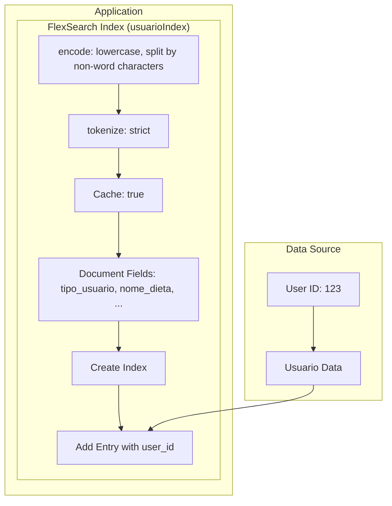

## Creating FlexSearch Index for Alimento Entity Linked to User ID

To efficiently search and retrieve data related to the "Alimento" entity based on specific fields, we use the FlexSearch library. This example demonstrates how to create an index for the "Alimento" entity and associate it with a user's ID.

### 1. Import FlexSearch

```javascript
const FlexSearch = require('flexsearch');
```

## Creating FlexSearch Index for Alimento Entity Linked to User ID

To efficiently search and retrieve data related to the "Alimento" entity based on specific fields, we use the FlexSearch library. This example demonstrates how to create an index for the "Alimento" entity and associate it with a user's ID.

### 1. Import FlexSearch

```javascript
const FlexSearch = require('flexsearch');
```

### 2. Create Alimento Index

```javascript
const alimentoIndex = new FlexSearch.Index({
  encode: str => str.toLowerCase().split(/\W+/),
  tokenize: 'strict', 
  cache: true,
  doc: {
    id: 'id_alimento',
    field: ['nome_alimento', 'descrição_alimento', 'calorias', 'proteínas', 'carboidratos', 'gorduras', 'valor_energetico', 'tamanho_porção', 'nutrientes', 'fonte', 'instruções_preparo', 'requisitos_armazenamento', 'índice_glicêmico', 'carga_glicemia', 'fibra', 'imagem_alimento', 'individual_grade', 'combined_grade', 'created_at', 'updated_at', 'active', 'excluido_em', 'arquivado', 'created_by_id', 'updated_by_id']
  }  
});
```

This code sets up an index for the "Alimento" entity, specifying the fields to include in the index.

### 3. Sync Alimento Data with Users

When processing a webhook, you can index "Alimento" data with the user's ID as follows:

```javascript
// Get user_id from webhook 
const user_id = 123;

// Alimento data
const alimento_data = {
  id_alimento: "xyz123",
  nome_alimento: "Apple",
  // other fields...
};

// Index alimento data with user's id
alimentoIndex.add(user_id, alimento_data);
```

This step associates "Alimento" data with a specific user by using their ID.

### 5. Example Implementation with FlexSearch

Assuming you have the FlexSearch library installed and your code environment set up, you can use the following implementation to create the Alimento index and associate Alimento data with a specific user.

```javascript
// Import FlexSearch
const FlexSearch = require('flexsearch');

// Create Alimento Index
const alimentoIndex = new FlexSearch.Index({
  encode: str => str.toLowerCase().split(/\W+/),
  tokenize: 'strict', 
  cache: true,
  doc: {
    id: 'id_alimento',
    field: ['nome_alimento', 'descrição_alimento', 'calorias', 'proteínas', 'carboidratos', 'gorduras', 'valor_energetico', 'tamanho_porção', 'nutrientes', 'fonte', 'instruções_preparo', 'requisitos_armazenamento', 'índice_glicêmico', 'carga_glicemia', 'fibra', 'imagem_alimento', 'individual_grade', 'combined_grade', 'created_at', 'updated_at', 'active', 'excluido_em', 'arquivado', 'created_by_id', 'updated_by_id']
  }  
});

// Assuming you have a user_id and alimento_data object as specified in the documentation
const user_id = 123;

const alimento_data = {
  id_alimento: "xyz123",
  nome_alimento: "Apple",
  descrição_alimento: "Description of Apple",
  calorias: 50,
  proteínas: 1,
  carboidratos: 13,
  gorduras: 0.2,
  valor_energetico: 200,
  tamanho_porção: "1 medium apple",
  nutrientes: "Vitamin C, Fiber",
  fonte: "USDA",
  instruções_preparo: "Wash and eat",
  requisitos_armazenamento: "Refrigerate",
  índice_glicêmico: 39,
  carga_glicemia: 5,
  fibra: 2.5,
  imagem_alimento: "url/to/apple-image",
  individual_grade: "A",
  combined_grade: "B",
  created_at: "2023-01-01T00:00:00Z",
  updated_at: "2023-01-02T12:30:00Z",
  active: true,
  excluido_em: null,
  arquivado: false,
  created_by_id: 456,
  updated_by_id: 789
};

// Index alimento data with user's id
alimentoIndex.add(user_id, alimento_data);

```javascript
// Create Analise Index
const analiseIndex = new FlexSearch.Index({
  encode: str => str.toLowerCase().split(/\W+/),
  tokenize: 'strict', 
  cache: true,
  doc: {
    id: 'id_analise',
    field: ['id_dieta', 'data_analise', 'provedor_analise', 'resultados_analise', 'recomendações_analise', 'carimbo_analise', 'tipo_analise', 'parâmetros_analisados', 'faixas_referencia', 'custo_analise', 'interpretação_analise', 'datas_referencia_resultados', 'duração_refeição', 'estado_emocional_refeição', 'created_at', 'updated_at', 'excluido_em', 'arquivado', 'created_by_id', 'updated_by_id']
  }  
});

// Assuming you have an user_id and analise_data object as specified in the documentation
const user_id = 123;

const analise_data = {
  id_analise: "abc123",
  id_dieta: "xyz789",
  data_analise: "2023-01-15T08:00:00Z",
  provedor_analise: "Health Lab",
  resultados_analise: "Healthy",
  recomendações_analise: "Increase fiber intake",
  carimbo_analise: "2023-01-15T10:30:00Z",
  tipo_analise: "Blood Test",
  parâmetros_analisados: "Cholesterol, Blood Sugar",
  faixas_referencia: "Normal Range",
  custo_analise: 100,
  interpretação_analise: "Results interpreted by a healthcare professional",
  datas_referencia_resultados: "2023-01-20T12:00:00Z",
  duração_refeição: "30 minutes",
  estado_emocional_refeição: "Happy",
  created_at: "2023-01-15T10:30:00Z",
  updated_at: "2023-01-16T14:45:00Z",
  excluido_em: null,
  arquivado: false,
  created_by_id: 456,
  updated_by_id: 789
};

// Index analise data with user's id
analiseIndex.add(user_id, analise_data);
```

// Create Refeicao Index
const refeicaoIndex = new FlexSearch.Index({
  encode: str => str.toLowerCase().split(/\W+/),
  tokenize: 'strict', 
  cache: true,
  doc: {
    id: 'id_refeição',
    field: ['id_dieta', 'nome_refeição', 'tipo_refeição', 'hora_refeição', 'local_refeição', 'companheiros_refeição', 'humor_refeição', 'nível_satisfação', 'notas_refeição', 'nível_fome_antes_refeição', 'nível_fome_após_refeição', 'custo_refeição', 'tempo_preparo_refeição', 'duração_refeição', 'estado_emocional_refeição', 'created_at', 'updated_at', 'active', 'excluido_em', 'arquivado', 'created_by_id', 'updated_by_id']
  }  
});

// Assuming you have a user_id and refeicao_data object as specified in the documentation
const user_id = 123;

const refeicao_data = {
  id_refeição: "abc456",
  id_dieta: "xyz987",
  nome_refeição: "Almoço",
  tipo_refeição: "Principal",
  hora_refeição: "12:30 PM",
  local_refeição: "Casa",
  companheiros_refeição: ["Amigo1", "Amigo2"],
  humor_refeição: "Feliz",
  nível_satisfação: "Satisfeito",
  notas_refeição: "Refeição saudável",
  nível_fome_antes_refeição: "Médio",
  nível_fome_após_refeição: "Satisfeito",
  custo_refeição: 20,
  tempo_preparo_refeição: "30 minutes",
  duração_refeição: "45 minutes",
  estado_emocional_refeição: "Alegre",
  created_at: "2023-02-01T12:30:00Z",
  updated_at: "2023-02-02T14:45:00Z",
  active: true,
  excluido_em: null,
  arquivado: false,
  created_by_id: 456,
  updated_by_id: 789
};

// Index refeicao data with user's id
refeicaoIndex.add(user_id, refeicao_data);

```javascript
// Create Usuario Index
const usuarioIndex = new FlexSearch.Index({
  encode: str => str.toLowerCase().split(/\W+/),
  tokenize: 'strict', 
  cache: true,
  doc: {
    id: 'id_usuario',
    field: [
      'tipo_usuario', 'nome_dieta', 'data_refeição', 'tipo_dieta', 'descrição_dieta', 'hora_inicio_refeição',
      'hora_fim_refeição', 'peso_usuario', 'altura_usuario', 'nível_atividade', 'meta_dieta', 'meta_dieta_especifica',
      'restrições_dietéticas', 'preferencias_alimentares', 'medicamentos_atuais', 'histórico_medico', 'coluna_analise_1',
      'coluna_analise_2', 'coluna_analise_3', 'peso_atual', 'imc', 'circunferencia_cintura', 'pressão_sanguínea', 'calorias',
      'proteínas', 'carboidratos', 'gorduras', 'valor_energético', 'id_alimento', 'id_refeição', 'data_inicio_dieta',
      'data_fim_dieta', 'metas', 'alimentos_recomendados', 'alimentos_evitados', 'gênero', 'data_nascimento',
      'nível_atividade_usuário', 'objetivos_saude', 'percentual_gordura', 'biografia_usuário', 'nível_satisfação_refeições',
      'feedback_refeições', 'data_inicio_dieta', 'data_fim_dieta', 'objetivos_saúde_específicos', 'coluna_analise_1',
      'coluna_analise_2', 'coluna_analise_3', 'histórico_peso', 'criado_em', 'atualizado_em', 'active', 'archived',
      'created_by_id', 'updated_by_id'
    ]
  }  
});

// Assuming you have a user_id and usuario_data object as specified in the documentation
const user_id = 123;

const usuario_data = {
  tipo_usuario: "Categoria A",
  nome_dieta: "Dieta A",
  data_refeição: "2023-03-01",
  tipo_dieta: "Categoria A",
  descrição_dieta: "Descrição da Dieta A",
  hora_inicio_refeição: "12:00 PM",
  hora_fim_refeição: "1:00 PM",
  peso_usuario: 70,
  altura_usuario: 170,
  nível_atividade: "Alto",
  meta_dieta: "Perda de peso",
  meta_dieta_especifica: "Perder 5 kg",
  restrições_dietéticas: "Sem glúten",
  preferencias_alimentares: "Vegetariano",
  medicamentos_atuais: "Medicamento X",
  histórico_medico: "Nenhum",
  coluna_analise_1: "Dado A",
  coluna_analise_2: "Dado B",
  coluna_analise_3: "Dado C",
  peso_atual: 68,
  imc: 23.5,
  circunferencia_cintura: 80,
  pressão_sanguínea: "120/80",
  calorias: 500,
  proteínas: 20,
  carboidratos: 50,
  gorduras: 25,
  valor_energético: 300,
  id_alimento: "abc123",
  id_refeição: "xyz789",
  data_inicio_dieta: "2023-01-01",
  data_fim_dieta: "2023-03-01",
  metas: '{"meta1": "Objetivo 1", "meta2": "Objetivo 2"}',
  alimentos_recomendados: '{"alimento1": "Recomendação 1", "alimento2": "Recomendação 2"}',
  alimentos_evitados: '{"alimento3": "Evitar 3", "alimento4": "Evitar 4"}',
  gênero: "Masculino",
  data_nascimento: "1990-01-01",
  nível_atividade_usuário: "Médio",
  objetivos_saude: "Manter a saúde geral",
  percentual_gordura: 15.5,
  biografia_usuário: "Usuário dedicado à saúde e bem-estar",
  nível_satisfação_refeições: "Satisfeito",
  feedback_refeições: "Boas escolhas alimentares",
  data_inicio_dieta: "2023-01-01",
  data_fim_dieta: "2023-03-01",
  objetivos_saúde_específicos: "Melhorar a resistência física",
  coluna_analise_1: "Dado A",
  coluna_analise_2: "Dado B",
  coluna_analise_3: "Dado C",
  histórico_peso: '{"2022-01-01": 75, "2022-02-01": 72, "2022-03-01": 70}',
  criado_em: "2023-01-01T10:00:00Z",
  atualizado_em: "2023-03-01T14:30:00Z",
  active: true,
  archived: false,
  created_by_id: 456,
  updated_by_id: 789
};

// Index usuario data with user's id
usuarioIndex.add(user_id, usuario_data);
```
