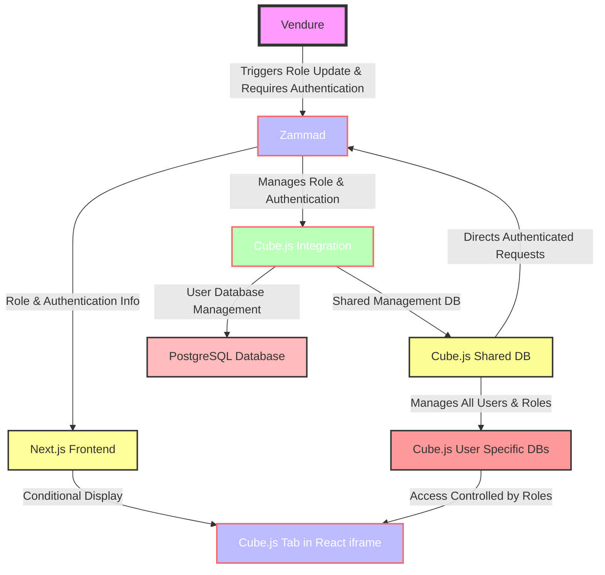

1. **Main Frontend Application (Next.js)**
    
    * Serves as the primary user interface.
    * Features various tabs, including a specialized tab for Cube.js.
    * The Cube.js tab is conditionally displayed, visible only to users granted the Cube.js role by Zammad.
2. **Cube.js Integration**
    
    * Incorporated within the main frontend via an iframe, using React for the interface.
    * Access to Cube.js functionalities is role-dependent, controlled by Zammad.
3. **User Role and Authentication Flow**
    
    * Vendure, the primary application, coordinates with Zammad for user role management and authentication.
    * User roles requiring Cube.js access are updated in Zammad via Vendure-triggered webhooks, which also inform Cube.js.
    * Zammad centralizes authentication, enabling the Cube.js tab in the Next.js frontend for users with the Cube.js role.
4. **Database Management in Cube.js**
    
    * _Individual User-Specific Databases_
        * **Creation and Purpose**: For each user, Cube.js creates a separate, personal PostgreSQL database. These databases are established following triggers from Vendure, when a user role is added or changed.
        * **Data Isolation and Security**: Each database is isolated, meaning a user's data is stored and managed independently from others'. This isolation ensures that we can provide 1 cube instance per customer, as each user's interactions are confined to their own database.
        * **User-Specific Analytics**: The individual databases allow for personalized cube data sets of each user.
5. **Frontend Display Logic**
    
    * The Next.js frontend dynamically adapts its UI to reflect user roles from Zammad.
    * Users with the Cube.js role see an additional tab for Cube.js, linking to a React-based interface within an iframe.
6. **Role Update Workflow Example**
    
    * When Vendure updates a user's role to require Cube.js access, it notifies Zammad.
    * Zammad then adjusts frontend access, making the Cube.js tab available or unavailable based on the user's updated role.

This integrates the frontend (Next.js) with backend services (Vendure, Zammad, Cube.js), creating  dynamic, role-based users. Cube.js provides personalized data handling through individual databases for each user, while Zammad centralizes role management and authentication, ensuring coherent access control across the platform.

### Cube.js Database Management System Overview

#### 1. Shared Management Database Structure

The Cube.js shared management database is pivotal for tracking user roles and email addresses. It's a central hub for managing user access and identifying which users have active databases.

```sql
-- Replace 'cube_management_db' with your actual database name to create the management database
CREATE DATABASE cube_management_db;

-- Switching to the management database
\c cube_management_db

-- Create the 'users' table in the management database
CREATE TABLE users (
    id SERIAL PRIMARY KEY,
    email VARCHAR(255) UNIQUE NOT NULL,
    status VARCHAR(50) NOT NULL CHECK (status IN ('active', 'inactive')),
    vendure_id INTEGER
);
```

#### 2. User-Specific Database Creation Process

Upon adding a new 'active' user to the management database, a unique database is created for them. 

```sql

-- Replace 'user_db' with a unique database name for each user
CREATE DATABASE user_specific_db;
```

#### 3. TypeScript Server Implementation

The server manages user authentication (via Zammad), interacts with the shared management database to verify user status, and connects to the individual databases for active users.

```typescript
import express, { Request, Response, NextFunction } from 'express';
import { Pool } from 'pg';
import dotenv from 'dotenv';

dotenv.config();

const app = express();
const port = process.env.PORT || 3000;

// Connection pool for the shared management database
const managementDbPool = new Pool({
  connectionString: process.env.MANAGEMENT_DB_URL,
  ssl: process.env.NODE_ENV === 'production' ? { rejectUnauthorized: false } : false,
});

// Middleware for Zammad Authentication
const authenticateUser = async (req: Request, res: Response, next: NextFunction) => {
  // Insert authentication logic here
  // Upon authentication, set req.user with user details
};

// Middleware to Verify User Status and Connect to Their Database
const connectToUserDb = async (req: Request, res: Response, next: NextFunction) => {
  const userEmail = req.user?.email;
  if (!userEmail) {
    return res.status(401).json({ error: 'Unauthorized' });
  }

  // Check user status in the management database
  const userStatusQuery = await managementDbPool.query('SELECT status FROM users WHERE email = $1', [userEmail]);
  const userStatus = userStatusQuery.rows[0]?.status;

  if (userStatus !== 'active') {
    return res.status(403).json({ error: 'User database access is inactive' });
  }

  // Establish a connection to the user-specific database
  req.userDbPool = new Pool({
    connectionString: `your_postgresql_connection_url_for_${userEmail}`,
    ssl: process.env.NODE_ENV === 'production' ? { rejectUnauthorized: false } : false,
  });

  next();
};

app.use(authenticateUser);
app.use(connectToUserDb);

// API endpoint to fetch data from the user-specific database
app.get('/api/v1/user-data', async (req: Request, res: Response) => {
  const userSpecificData = await req.userDbPool.query('SELECT * FROM your_table_name');
  res.json(userSpecificData.rows);
});

app.listen(port, () => console.log(`Server running on port ${port}`));
```

#### Environment Variables in `.env`

```plaintext
# .env file configuration

MANAGEMENT_DB_URL=your_management_database_url
NODE_ENV=development
PORT=3000
```
