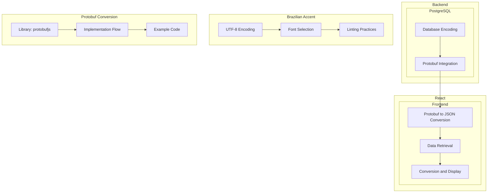

## Backend (PostgreSQL) Configuration:

1. **Database Encoding:**
    
    * Ensure your Postgres database is configured with UTF-8 encoding.
2. **Protobuf Integration:**
    
    * Serialize data into Protobuf messages using the appropriate Protobuf definition file.
3. **Protobuf to JSON Conversion:**
    
    * Convert Protobuf messages to JSON before transmitting to the React application.

## Frontend (React) Implementation:

1. **Data Retrieval:**
    
    * Receive JSON data from the backend.
2. **Conversion and Display:**
    
    * Decode JSON to Protobuf using the corresponding Protobuf definition file.
    * Use the decoded Protobuf messages to populate user interface elements.

## Brazilian Accent Considerations:

1. **UTF-8 Encoding:**
    
    * Utilize UTF-8 encoding when retrieving data from Postgres and converting it to JSON.
2. **Font Selection:**
    
    * Employ UTF-8 encoding for text elements in React components.
    * Choose a font that supports Brazilian Portuguese characters.
3. **Linting Practices:**
    
    * Consider integrating a UI linter such as eslint-plugin-react or react-lint to enforce proper encoding and font usage.

## Protobuf Conversion Library and Use Case:

1. **Library:**
    
    * Utilize the `protobufjs` library for seamless Protobuf to JSON conversion.
    * Install the library using:
        
        ```bash
        npm install protobufjs
        ```
        
2. **Implementation Flow:**
    
    * In the backend, convert data to Protobuf format.
    * Use `protobufjs` to convert Protobuf to JSON before transmitting to the frontend.
3. **Example Code:**
    
    * Backend (Node.js):
        
        ```javascript
        const protobuf = require('protobufjs');
        const root = protobuf.loadSync('path/to/protobuf_definition.proto');
        const MyMessage = root.lookupType('MyMessage');
        
        // Convert data to Protobuf
        const protobufData = MyMessage.create({ /* your data */ });
        
        // Convert Protobuf to JSON
        const jsonData = MyMessage.toObject(protobufData, { defaults: true, longs: String, enums: String, bytes: String });
        ```
        
    * Frontend (React):
        
        ```javascript
        // Receive JSON data from the backend
        const jsonData = /* received JSON data */;
        
        // Convert JSON to Protobuf
        const protobufData = MyMessage.fromObject(jsonData);
        
        // Use the decoded Protobuf messages in the UI
        ```
